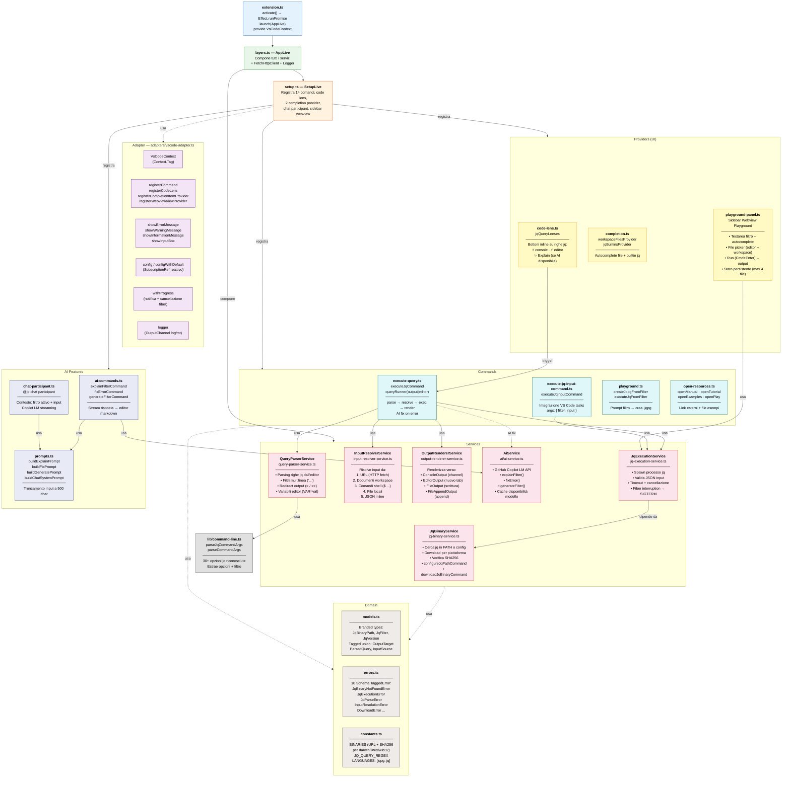
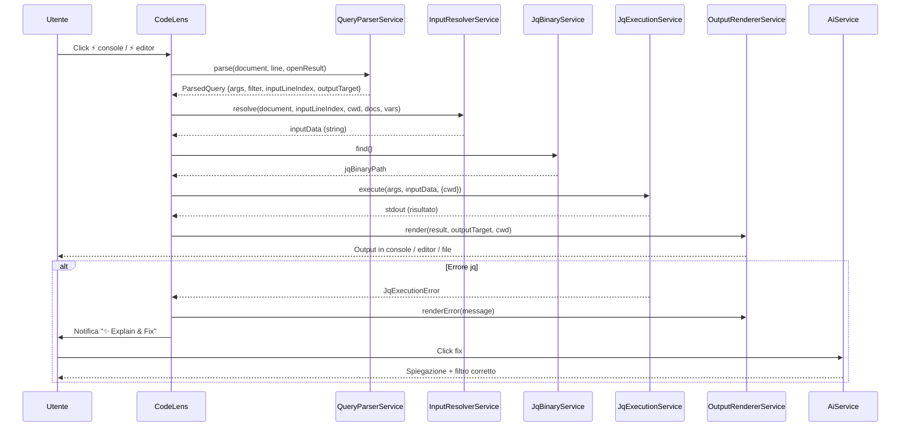

# vscode-jq-playground — Architecture

```mermaid
graph TB
  %% ── Entry Point ──────────────────────────────────────────
  EXT["<b>extension.ts</b><br/>activate() → Effect.runPromise<br/>launch(AppLive)<br/>provide VsCodeContext"]

  %% ── Layer Composition ────────────────────────────────────
  APP["<b>layers.ts — AppLive</b><br/>Compone tutti i servizi<br/>+ FetchHttpClient + Logger"]
  SETUP["<b>setup.ts — SetupLive</b><br/>Registra 14 comandi, code lens,<br/>2 completion provider,<br/>chat participant, sidebar webview"]

  EXT --> APP --> SETUP

  %% ── Adapter ──────────────────────────────────────────────
  subgraph ADAPTER ["Adapter — adapters/vscode-adapter.ts"]
    direction LR
    AD_CTX["VsCodeContext<br/>(Context.Tag)"]
    AD_CMD["registerCommand<br/>registerCodeLens<br/>registerCompletionItemProvider<br/>registerWebviewViewProvider"]
    AD_UI["showErrorMessage<br/>showWarningMessage<br/>showInformationMessage<br/>showInputBox"]
    AD_CFG["config / configWithDefault<br/>(SubscriptionRef reattivo)"]
    AD_PROG["withProgress<br/>(notifica + cancellazione fiber)"]
    AD_LOG["logger<br/>(OutputChannel logfmt)"]
  end

  SETUP -.->|usa| ADAPTER

  %% ── Services ─────────────────────────────────────────────
  subgraph SERVICES ["Services"]
    direction TB

    BINARY["<b>JqBinaryService</b><br/>jq-binary-service.ts<br/>─────────────────<br/>• Cerca jq in PATH o config<br/>• Download per piattaforma<br/>• Verifica SHA256<br/>• configureJqPathCommand<br/>• downloadJqBinaryCommand"]

    EXEC["<b>JqExecutionService</b><br/>jq-execution-service.ts<br/>─────────────────<br/>• Spawn processo jq<br/>• Valida JSON input<br/>• Timeout + cancellazione<br/>• Fiber interruption → SIGTERM"]

    PARSER["<b>QueryParserService</b><br/>query-parser-service.ts<br/>─────────────────<br/>• Parsing righe jq dall'editor<br/>• Filtri multilinea ('...')<br/>• Redirect output (&gt; / &gt;&gt;)<br/>• Variabili editor (VAR=val)"]

    INPUT["<b>InputResolverService</b><br/>input-resolver-service.ts<br/>─────────────────<br/>Risolve input da:<br/>1. URL (HTTP fetch)<br/>2. Documenti workspace<br/>3. Comandi shell ($ ...)<br/>4. File locali<br/>5. JSON inline"]

    OUTPUT["<b>OutputRendererService</b><br/>output-renderer-service.ts<br/>─────────────────<br/>Renderizza verso:<br/>• ConsoleOutput (channel)<br/>• EditorOutput (nuovo tab)<br/>• FileOutput (scrittura)<br/>• FileAppendOutput (append)"]

    AI_SVC["<b>AiService</b><br/>ai/ai-service.ts<br/>─────────────────<br/>• GitHub Copilot LM API<br/>• explainFilter()<br/>• fixError()<br/>• generateFilter()<br/>• Cache disponibilità modello"]

    EXEC -->|dipende da| BINARY
  end

  APP -->|compone| SERVICES

  %% ── Commands ─────────────────────────────────────────────
  subgraph COMMANDS ["Commands"]
    direction TB

    CMD_EQ["<b>execute-query.ts</b><br/>executeJqCommand<br/>queryRunner(output|editor)<br/>─────────────────<br/>parse → resolve → exec → render<br/>AI fix on error"]

    CMD_EIC["<b>execute-jq-input-command.ts</b><br/>executeJqInputCommand<br/>─────────────────<br/>Integrazione VS Code tasks<br/>args: { filter, input }"]

    CMD_PG["<b>playground.ts</b><br/>createJqpgFromFilter<br/>executeJqFromFilter<br/>─────────────────<br/>Prompt filtro → crea .jqpg"]

    CMD_RES["<b>open-resources.ts</b><br/>openManual · openTutorial<br/>openExamples · openPlay<br/>─────────────────<br/>Link esterni + file esempi"]
  end

  SETUP -->|registra| COMMANDS

  CMD_EQ -->|usa| PARSER
  CMD_EQ -->|usa| INPUT
  CMD_EQ -->|usa| EXEC
  CMD_EQ -->|usa| OUTPUT
  CMD_EQ -.->|AI fix| AI_SVC
  CMD_EIC -->|usa| EXEC

  %% ── Providers ────────────────────────────────────────────
  subgraph PROVIDERS ["Providers (UI)"]
    direction TB

    PROV_CL["<b>code-lens.ts</b><br/>jqQueryLenses<br/>─────────────────<br/>Bottoni inline su righe jq:<br/>⚡ console · ⚡ editor<br/>✨ Explain (se AI disponibile)"]

    PROV_COMP["<b>completion.ts</b><br/>workspaceFilesProvider<br/>jqBuiltinsProvider<br/>─────────────────<br/>Autocomplete file + builtin jq"]

    PROV_PP["<b>playground-panel.ts</b><br/>Sidebar Webview Playground<br/>─────────────────<br/>• Textarea filtro + autocomplete<br/>• File picker (editor + workspace)<br/>• Run (Cmd+Enter) → output<br/>• Stato persistente (max 4 file)"]
  end

  SETUP -->|registra| PROVIDERS

  PROV_CL -->|trigger| CMD_EQ
  PROV_PP -->|usa| EXEC

  %% ── AI Features ──────────────────────────────────────────
  subgraph AI ["AI Features"]
    direction TB

    AI_CMD["<b>ai-commands.ts</b><br/>explainFilterCommand<br/>fixErrorCommand<br/>generateFilterCommand<br/>─────────────────<br/>Stream risposta → editor markdown"]

    AI_CHAT["<b>chat-participant.ts</b><br/>@jq chat participant<br/>─────────────────<br/>Contesto: filtro attivo + input<br/>Copilot LM streaming"]

    AI_PROMPT["<b>prompts.ts</b><br/>buildExplainPrompt<br/>buildFixPrompt<br/>buildGeneratePrompt<br/>buildChatSystemPrompt<br/>─────────────────<br/>Troncamento input a 500 char"]
  end

  SETUP -->|registra| AI

  AI_CMD -->|usa| AI_SVC
  AI_CMD -->|usa| AI_PROMPT
  AI_CHAT -->|usa| AI_PROMPT

  %% ── Domain ───────────────────────────────────────────────
  subgraph DOMAIN ["Domain"]
    direction LR

    DOM_MOD["<b>models.ts</b><br/>─────────────────<br/>Branded types:<br/>JqBinaryPath, JqFilter, JqVersion<br/>Tagged union: OutputTarget<br/>ParsedQuery, InputSource"]

    DOM_ERR["<b>errors.ts</b><br/>─────────────────<br/>10 Schema.TaggedError:<br/>JqBinaryNotFoundError<br/>JqExecutionError<br/>JqParseError<br/>InputResolutionError<br/>DownloadError ..."]

    DOM_CONST["<b>constants.ts</b><br/>─────────────────<br/>BINARIES (URL + SHA256<br/>per darwin/linux/win32)<br/>JQ_QUERY_REGEX<br/>LANGUAGES: [jqpg, jq]"]
  end

  SERVICES -.->|usa| DOMAIN
  COMMANDS -.->|usa| DOMAIN

  %% ── Lib ──────────────────────────────────────────────────
  LIB["<b>lib/command-line.ts</b><br/>parseJqCommandArgs<br/>parseCommandArgs<br/>─────────────────<br/>30+ opzioni jq riconosciute<br/>Estrae opzioni + filtro"]

  PARSER -->|usa| LIB

  %% ── Styling ──────────────────────────────────────────────
  classDef entry fill:#e3f2fd,stroke:#1565c0,color:#000
  classDef layer fill:#e8f5e9,stroke:#2e7d32,color:#000
  classDef setup fill:#fff3e0,stroke:#e65100,color:#000
  classDef service fill:#fce4ec,stroke:#c62828,color:#000
  classDef command fill:#e0f7fa,stroke:#00695c,color:#000
  classDef provider fill:#fff9c4,stroke:#f9a825,color:#000
  classDef ai fill:#e8eaf6,stroke:#283593,color:#000
  classDef domain fill:#efebe9,stroke:#4e342e,color:#000
  classDef adapter fill:#f3e5f5,stroke:#6a1b9a,color:#000
  classDef lib fill:#e0e0e0,stroke:#424242,color:#000

  class EXT entry
  class APP layer
  class SETUP setup
  class BINARY,EXEC,PARSER,INPUT,OUTPUT,AI_SVC service
  class CMD_EQ,CMD_EIC,CMD_PG,CMD_RES command
  class PROV_CL,PROV_COMP,PROV_PP provider
  class AI_CMD,AI_CHAT,AI_PROMPT ai
  class DOM_MOD,DOM_ERR,DOM_CONST domain
  class AD_CTX,AD_CMD,AD_UI,AD_CFG,AD_PROG,AD_LOG adapter
  class LIB lib
```

## Flusso di esecuzione

```mermaid
sequenceDiagram
  participant U as Utente
  participant CL as CodeLens
  participant QP as QueryParserService
  participant IR as InputResolverService
  participant JB as JqBinaryService
  participant JE as JqExecutionService
  participant OR as OutputRendererService
  participant AI as AiService

  U->>CL: Click ⚡ console / ⚡ editor
  CL->>QP: parse(document, line, openResult)
  QP-->>CL: ParsedQuery {args, filter, inputLineIndex, outputTarget}

  CL->>IR: resolve(document, inputLineIndex, cwd, docs, vars)
  IR-->>CL: inputData (string)

  CL->>JB: find()
  JB-->>CL: jqBinaryPath

  CL->>JE: execute(args, inputData, {cwd})
  JE-->>CL: stdout (risultato)

  CL->>OR: render(result, outputTarget, cwd)
  OR-->>U: Output in console / editor / file

  alt Errore jq
    JE-->>CL: JqExecutionError
    CL->>OR: renderError(message)
    CL->>U: Notifica "✨ Explain & Fix"
    U->>AI: Click fix
    AI-->>U: Spiegazione + filtro corretto
  end
```
